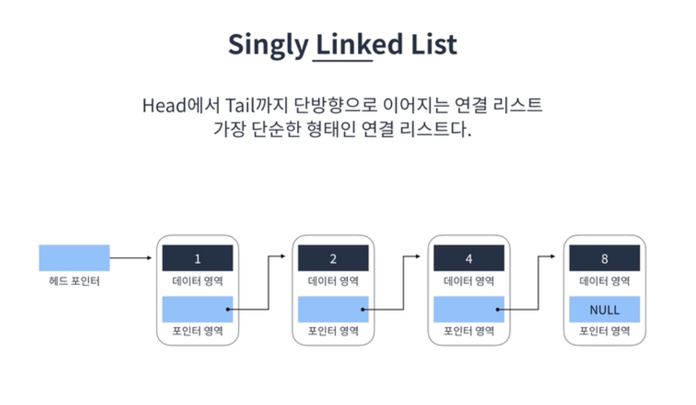
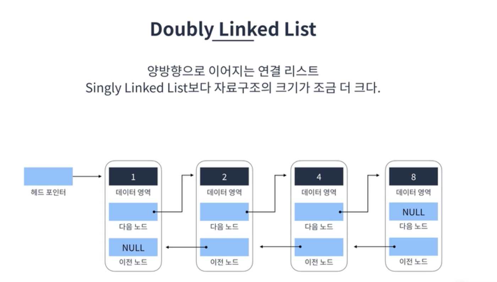
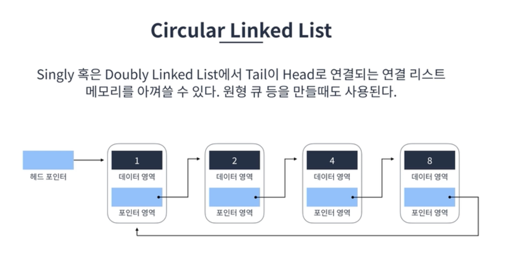
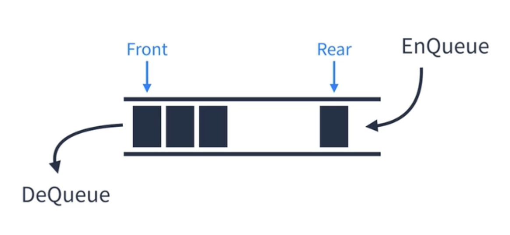
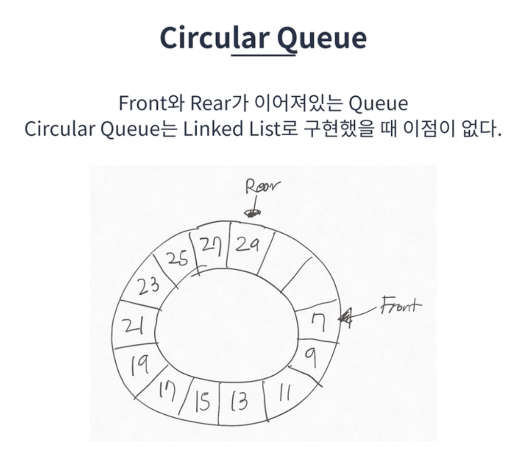

# 연결 리스트

### 각 요소를 포인터로 연결하여 관리하는 선형 자료구조이다. 각 요소는 노드라고 부르며 데이터 영역과 포인터 영역으로 구성된다

`특징`

- 메모리가 허용하는 한 요소를 제한없이 추가할 수 있다.
- 탐색은 O(n) (선형시간) 이 소요된다.
- 요소를 추가하거나 제거할 때는 O(1) (상수시간) 이 소요된다.
- Singly Linked List, Double Linked List, Circular Linked Lsit 가 존재한다

`핵심로직`

- 요소 찾기
- 요소 추가
- 요소 삭제

<br>
## Singly Linked List (단일연결리스트)




## Double Linked List (이중연결리스트)



 
<br>
## Circular Linked List (환형연결리스트) 



<br>
## 스택

Last In First Out 이라는 개념을 가진 선형자료구조다. 바닥이 막힌 상자를 생각하면 편하다

`스택 표현방법`

- 배열 (push, pop)
- 연결리스트


<br>
## 스택_올바른 괄호 실습

`문제`

괄호가 바르게 짝지어졌다는 것은 '(' 문자로 열렸으면 반드시 짝지어서 ')' 문자로 닫혀야 한다는 뜻입니다. 예를 들어

- "()()" 또는 "(())()" 는 올바른 괄호입니다.
- ")()(" 또는 "(()(" 는 올바르지 않은 괄호입니다.

'(' 또는 ')' 로만 이루어진 문자열 s가 주어졌을 때, 문자열 s가 올바른 괄호이면 true를 return 하고, 올바르지 않은 괄호이면 false를 return 하는 solution 함수를 완성해 주세요.

### 제한사항

- 문자열 s의 길이 : 100,000 이하의 자연수
- 문자열 s는 '(' 또는 ')' 로만 이루어져 있습니다.

---

```jsx
function solution(s) {
    const stack = [];

    for (const c of s) {
        if (c === '(') {
            stack.push(c);
        } else {
            if (stack.length === 0) {
                return false;
            }
            stack.pop();
        }
    }
    return stack.length === 0;

```

stack 에 값을 넣긴했지만 우리는 그 값을 꺼내서 쓰거나 하지는 않는다.

그래서 stack의 방식을 이용하지만 stack을 사용하지 않는 방법으로 조금 더 간단한 코드로 구현해보자

```jsx
function solution(s) {
    let count = 0;

    for (const c of s) {
        if (c === '(') {
            count += 1
        } else {
            if (count === 0) {
                return false;
            }
            count -= 1
        }
    }
    return count === 0;
```

메모리를 조금 더 적게 사용하여 풀어보았다

<br><br>
## 큐

First In First Out 이라는 개념을 가진 선형 자료구조이다. Linear Queue (선형큐) 와  Circular Queue (환형큐) 가 존재한다.



### Linear Queue (선형큐)

아래의 두가지 방식으로 구현할 수 있음

- Array(배열) 로 표현하기 ( 스택보다는 좀 어려움)
- Linked list(연결리스트) 로 표현하기

**큐에서는 shift 함수는 쓰지말자! O(n) 선형시간이 소요되기때문**

<br>
### Circular Queue (환형큐)



한정된 공간을 효율적으로 사용할때 사용됨

→ 코딩테스트에는 구지 환영큐를 사용해야될 경우는 거의 없음