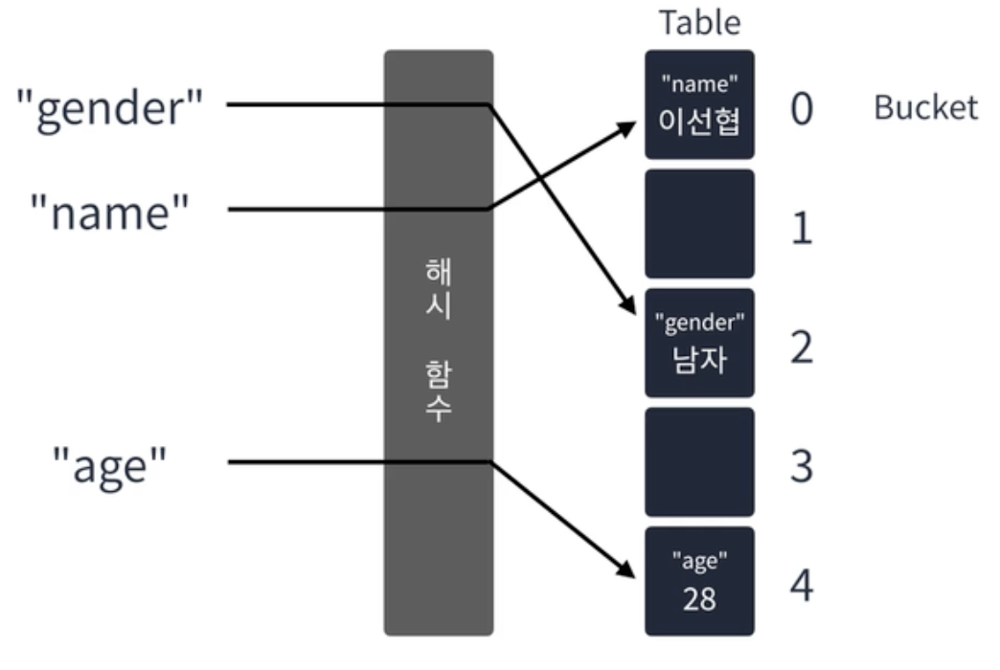

해시 테이블

키와 값을 받아 키를 해싱하여 나온 인덱스에 값을 저장하는 선형 자료구조이다.  삽입은 O(1)이며 키를 알고 있다면 삭제, 탐색도 O(1)로 수행한다.



<br>
### 해시함수 :  입력받은 값을 특정 범위 내 숫자로 변경하는 함수

“Hash Collision” - 해시 충돌

: 해시 함수의 결과가 동일한 값으로 나온 경우

1. 선형 탐사법 : 충돌이 발생하면 옆으로 한 칸 이동한다. → 최악의 경우 선형시간 (O(n)) 이 걸릴 수 있음
2. 제곱 탐사법 : 충돌이 발생 한 지점에서 충돌이 발생한 횟수의 제곱만큼 옆으로 이동한다. → 데이터가 몰리지 않음 
3. 이중 해싱 :  충돌이 발생하면 기존 해시함수가 아닌 다른 해시 함수를 이용하여 새로운 인덱스를 만들어낸다.
4. 분리 연결법 :  충돌이 발생할 경우 다른 인덱스로 이동하지 않는다. 대신 해시테이블의 요소를 연결리스트  대신 해시테이블의 요소를 연결리스트로 만들어 충돌이 발생한 버킷에 그대로  요소를 추가한다. → 최악의 경우, 하나의 버킷이 무한정 늘어날 수 있다

<br><br>
Javascript 에서 해시테이블 사용하기

1. 배열 
2. 객체
3. Map ( set, get )
4. Set

<br><br><br>
### 해시 테이블_베스트 앨범 실습

`문제`

스트리밍 사이트에서 장르 별로 가장 많이 재생된 노래를 두 개씩 모아 베스트 앨범을 출시하려 합니다. 노래는 고유 번호로 구분하며, 노래를 수록하는 기준은 다음과 같습니다.

1. 속한 노래가 많이 재생된 장르를 먼저 수록합니다.
2. 장르 내에서 많이 재생된 노래를 먼저 수록합니다.
3. 장르 내에서 재생 횟수가 같은 노래 중에서는 고유 번호가 낮은 노래를 먼저 수록합니다.
노래의 장르를 나타내는 문자열 배열 genres와 노래별 재생 횟수를 나타내는 정수 배열 plays가 주어질 때, 베스트 앨범에 들어갈 노 래의 고유 번호를 순서대로 return 하도록 solution 함수를 완성하세요.
제한사항
• genres[l)는 고유번호가 1인 노래의 장르입니다.
• plays[)는 고유번호가 1인 노래가 재생된 횟수입니다.
• genres와 plays의 길이는 같으며, 이는 1 이상 10,000 이하입니다.
• 장르 종류는 100개 미만입니다.
• 장르에 속한 곡이 하나라면, 하나의 곡만 선택합니다.
• 모든 장르는 재생된 횟수가 다릅니다.
    
    
    입출력 예
    <br>
    genres - ['classic", "pop", "classic", "classic", "pop']
    <br>
    plays - [500, 600, 150, 800, 2500]
    <br>
    return -  [4, 1, 3, 0]

```jsx
//1. 같은 장르끼리 묶어야해요.
//2. 묶인 노래들을 재생 순으로 정렬을 해야해요.
//3. 노래를 2개까지 자르는 작업을 해야해요.
//핵심 키워드는 "묶는 것", "정렬"
function solution(genres, plays) {
    const genreMap = new Map();

    genres
        .map((genre, index) => [genre, plays[index]])
        .forEach(([genre, play], index) => {
            const data = genreMap.get(genre) || { total: 0, songs: [] };
            genreMap.set(genre, {
                total: data.total + play,
                songs: [...data.songs, { play, index }]
                    .sort((a, b) => b.play - a.play)
                    .slice(0, 2)
            })
        })
    return [...genreMap.entries()]
        .sort((a, b) => b[1].total - a[1].total)
        .flatMap(item => item[1].songs)
        .map(song => song.index)
}
```