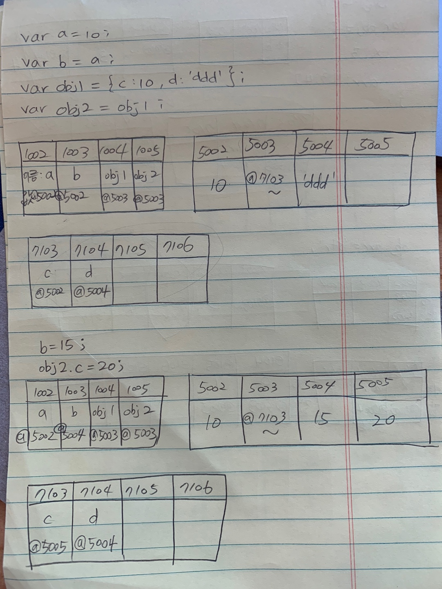

# 데이터 타입

### **자바스크립트 두가지 데이터타입의 차이점 &**그 차이가 발생하는 원인

**자바스크립트 데이터 타입**

1. Primitive Type (기본형) : 숫자, 문자열, boolean, null, undefined + Synbol (ES6)
2. Reference Type (참조형) :  객체 , 배열, 함수, 정규표현식 + Set ,WeakSet, Map, WeakMap (ES6)

둘을 구분하는 이유, 어떤 차이가 있는지. 각 데이터가 메모리상에서 저장되는 형태를 통해서 같이 살펴보자.

**자바스크립트 메모리 구조**

1. stack memory : 변수, 기본형 데이터, 정적할당
2. heap memory : 참조형 데이터, 동적할당

{: width="270" height="360"}

{: width="270" height="360"}

값을 직접 저장 

- 데이터 할당시에는 빠름
- 비교에 비용이 많이 듦
- 메모리 낭비가 심함

값의 주소를 저장

- 데이터 할당시에는 느림
- 비교에 비용이 들지 않음
- 메모리 낭비 최소화

{: width="270" height="360"}

기본형과 참조형은 이렇게 차이가 발생합니다.